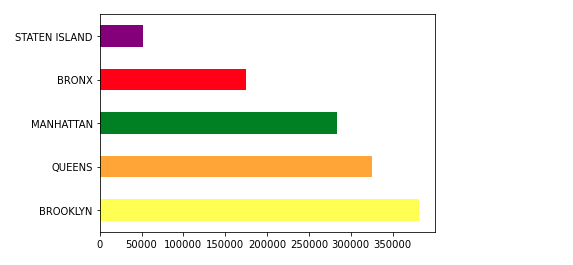
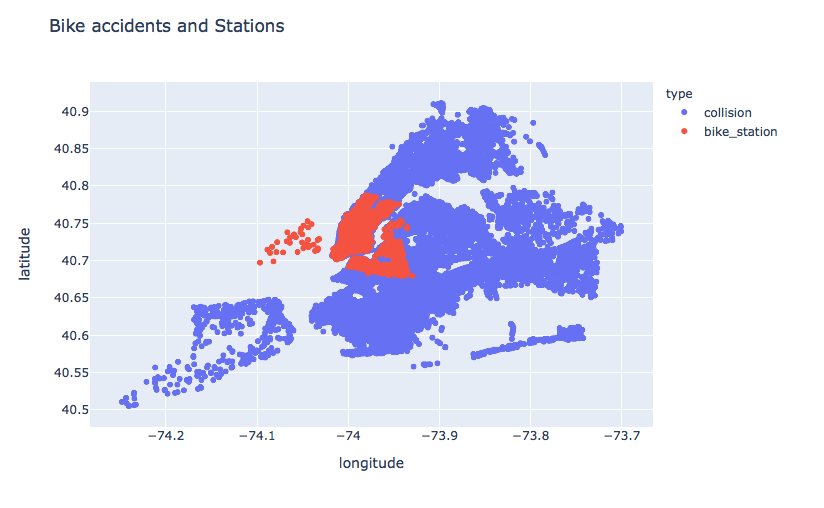
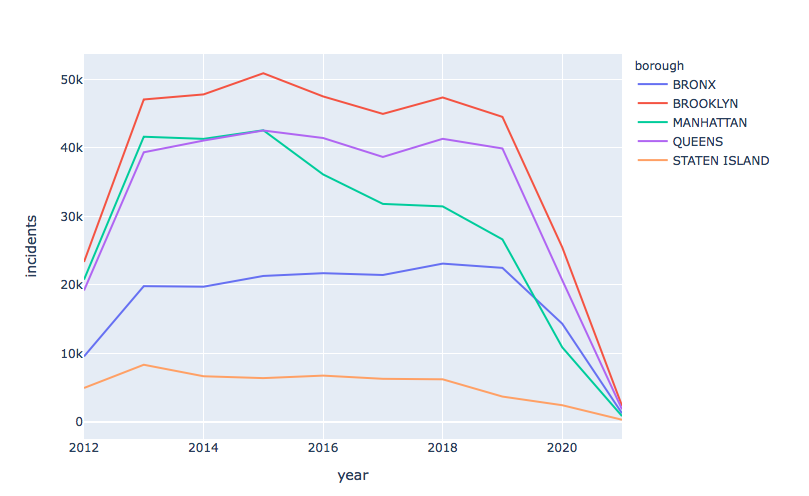
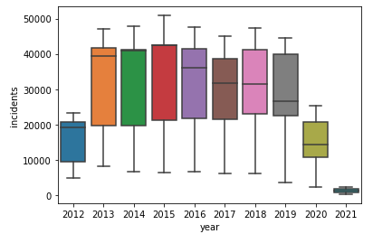
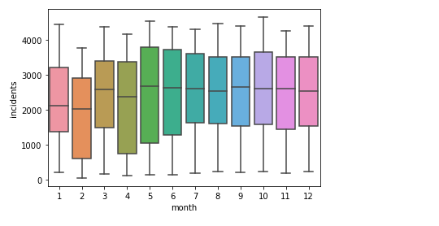
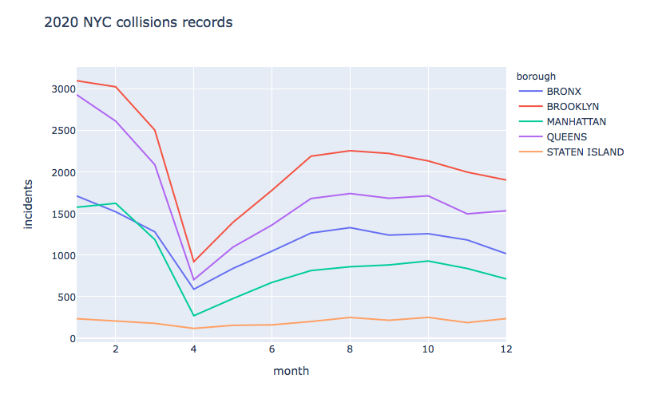
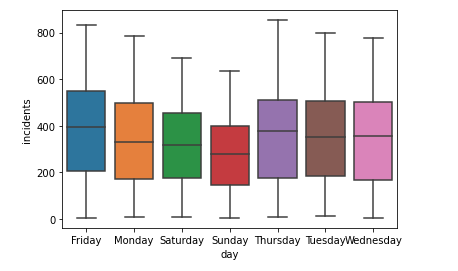
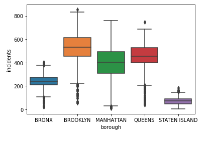
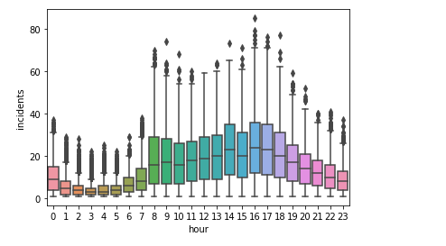
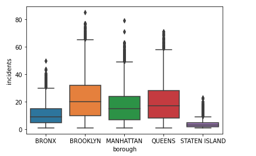

### Question I
• What is the most dangerous NYC borough / area for a bicycle rider? Use visualization.  
--> The most dangerous NYC borough / area for a bicycle rider is Brooklyn. It is followed by Manhattan and the Queens. 
 
A quick look at the available data, shows that Brookly and the queens have the most collisions. Followed by Manhattan then the Bronx.  
We can also do the following data cleaning for a more in-depth analysis:  
- Adding some of the missing data 
- Check collisions involving bicycles: Cyclists injured/killed - type of vehicle 
- Check the values integrating the datetime values  

Checking the current collisions data borough statistics, we find that: 
The number of cyclists both injured or killed is at its highest in Brooklyn and Manhattan. 
The pedestrian and motorists data show different trends which leads to suspect that indeed Brooklyn and Manhattan are higher risk boroughs for bicycle riders. 

### Question II
• What would you change in the locations of bike stations to increase safety? Use visualization.  
 
----> There are regions with lower bike stations densities and others not covered yet.  
We should expend in both: 
- Regions with low bike stations coverage but high population density and prone to some activites (like tourism, work, sport...) 
- Extend to regions that are not covered yet (first understand the areas needs) 

Cyclist injured and killed collisions:  4027
             <table>
		<thead>
		  <tr>
		    <th>Borough</th>
		    <th>Cyclists Affected</th>
		  </tr>
		</thead>
		<tbody>
		  <tr>
		    <td>BROOKLYN</td>
		    <td>12442</td>
		  </tr>
		  <tr>
		    <td>MANHATTAN</td>>
		    <td>9143</td>
		  </tr>
		  <tr>
		    <td>QUEENS</td>
		    <td>6199</td>
		  </tr>
		  <tr>
		    <td>BRONX</td>
		    <td>3205</td>
		  </tr>
		  <tr>
		    <td>STATEN ISLAND</td>
		    <td>357</td>
		  </tr>
		</tbody>
	    </table>
         

### Question III
• Where can an accident occur and how close is this from the nearest bike station? Create a predictive model 
--> Spatiotemporal data 
- Classification biased (array_of_frequency_reshape.value_counts()). Not descriminating between a single accident or many accidents  
- TimeseriesGenerator: Training the model on the preceeding 6 days to prdict the 7th (using keras TimeseriesGenerator) 
- ConvLSTM2D: Xingjian Shi et al. proposed a network structure able to capture spatiotemporal correlations, namely ConvLSTM. In Keras, this is reflected in the ConvLSTM2D class, which computes convolutional operations in both the input and the recurrent transformations. 
 
--> The current approach to solving the problem is relevant and reached an accuracy of 95%. A classification problem requires often other evaluation metrics than the accuracy. Based on the problem faced, the customer may want to focus on lowering the false negatives. In this case we refer to the confusion matrix, precision, recall, f1 score and roc_auc_score  
We suggest further work on the data as well as on the model type, architecture and parameters. Further iteration and experimentation are recommended.  

### Question IV:

#### Question a:
What other interesting patterns do you find in the data?  
--> We find very interesting patterns in: 
- STREET NAME 
- CONTRIBUTING FACTOR  
- VEHICLE TYPE CODE 
- Datetime data 

Analysis by time and borough 

1.The Years 
 
Manhattan has radically been inproving its figures from 2015. The general findings we got before are proved on a yearly bases. 
 
From 2019, the data has been showing a decrease in incident records. In 2020, we notice a radical drop to 2012 values (we suspect it s covid restrictions relations) 

2.The Months 
 
The montly records are pretty steady with slightly lower values in winter seasons and an increase from Mai 
 
The April 2020 sudden drop in records supports our supposition of the effects of covid restrictions effects (A quick check online supports this too but has to be confirmed) 

3.The days 
 
The weekend records are lowers compaired to the rest of the active week. 
 

4.The Hours 
 
There are higher risks of collisions during the standard active hours of the day from 8am -10pm 
 
Brooklyn keeps the highest levels of risks even by hourly data  

Note: Similar analysis can be done to only the cyclists or even to the trio [pedestrian, cyclists, bikes] 

#### Question b:
What other data sources would be interesting to correlate?  
- Cycling conditions / pathways  
- Traffic conditions  
- Weather  
- Populations / cyclists / communities 
- Activities (entertainment, work, restauration) 
